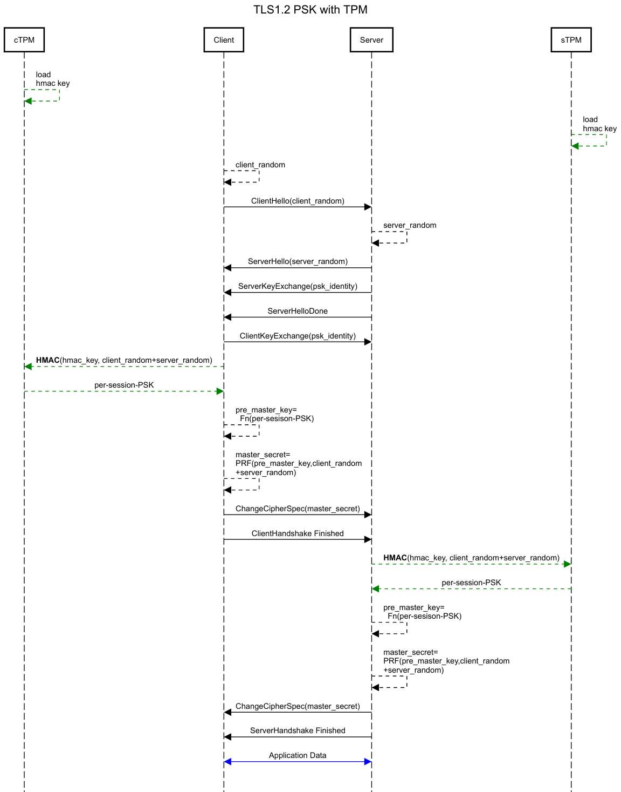
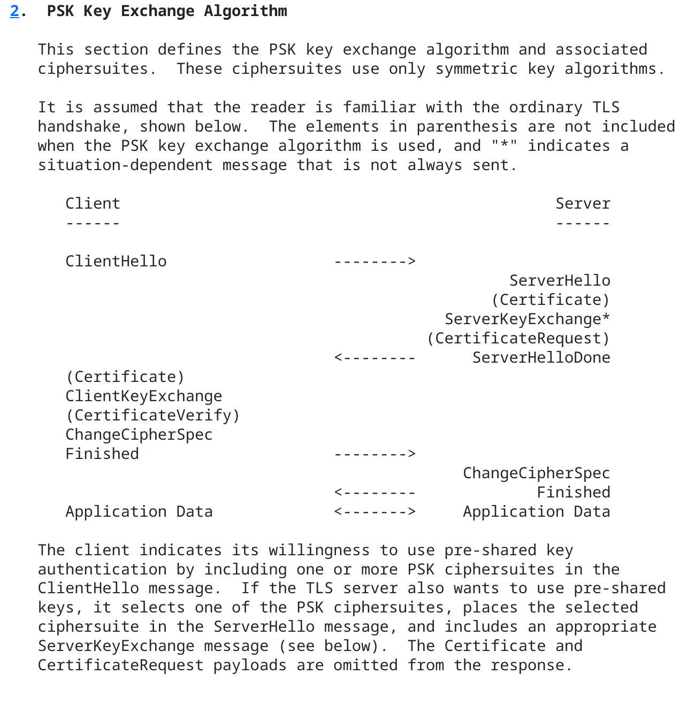

## Per-Session TLS1.2-PSK using Trusted Platform Module (TPM)

This repo demonstrates a variation of [TLS-PSK](https://en.wikipedia.org/wiki/TLS-PSK) for `TLS1.2` where the actual PSK is embedded inside a `Trusted Platform Module (TPM)`

[TLS-PSK](https://datatracker.ietf.org/doc/html/rfc4279) relies on a shared secret between the participants where the secret provides the basis to drive keys used to establish the TLS connection.

Normally, the PSK is a long term secret and is eventually visible in user-space (i.,e the application) during connection setup.  This poses a risk because, you know, it can get misplaced at a bar or stolen.

This repo describes a mechanism where the long term/permanent PSK is embedded inside the a TPM and is never exported but what is exported is a temporary per-session PSK.

Basically, the TPM is used to derive the a per-session/connection PSK based on the TLS handshake data and TPM operations against the permanent PSK.

Now, if you just wanted to encrypt a PSK using a TPM, thats easy:  just [Seal and unseal data in TPM](https://community.infineon.com/t5/Blogs/Sealing-and-unsealing-data-in-TPM/ba-p/465547) or use [go-tpm-wrapping](https://github.com/salrashid123/go-tpm-wrapping).  However, the unsealing step will still expose the permanent PSK to the application layer.

Consider if both client and server have loaded an the same `permanent PSK` into their TPMs:

During TLS-PSK negotiation, the `permanent PSK `is used to derive the `per-session PSK` which is then used during normal `pre_master_secret` generation for the TLS session (see references below).

Each TLS session uses a new `per-session PSK` which is generated on the spot identically by both the client and server.  This `per-session PSK` is used as if its a PSK in regular TLS session setup.

```bash
tpm_key = tpm2_load(permanent_psk)

per_session_psk = TPM_HMAC(tpm_key, "pre master secret" + client_random + server_random)

## rest of standard TLS protocol for PSK
pre_master_secret = # generate a standard pre_master_key using per_session_psk; see references below
master_secret = PRF(pre_master_secret, "master secret" + client_random + server_random)
```

The `client_random` and `server_random` are TLS handshake parameters normally reserved to create the `master_secret` but we're using here as values for the `TPM_HMAC()` for uniqueness  (ideally, the `HMAC` should be a `KDF` but its not a big deal).

Ultimately, what you end up with is a new PSK per session since the client and server random values are defined per TLS session itself.

The important note is that this repo does not modify the TLS protocol in anyway but just redefines what is done to acquire the PSK itself.  Once the PSK is acquired (eg, the `per-session PSK`), the rest of the TLS protocol takes place normally.

The items in green below describes the `per_session PSK` generation and the changes described in this repo while the steps in black are standard TLS protocol sequences





>>> **WARNING** this has not been reviewed or used in practice;  this is just a random idea and isn't 'out of the box' compatible with programming languages implementing TLS-PSK (because you have to derive a new key using client and server random); caveat emptor

**Important**: this scheme does not work for `TLS1.3` because that revision requires [TLS1.3 PSK Binder](https://datatracker.ietf.org/doc/html/rfc8446#section-4.2.11.2)' in the protocol 

For reference, see

- [In PSK TLS, how is the key used for encryption derived?](https://security.stackexchange.com/questions/81597/in-psk-tls-how-is-the-key-used-for-encryption-derived)
- [TLS, Pre-Master Secrets and Master Secrets](https://www.cryptologie.net/article/340/tls-pre-master-secrets-and-master-secrets/)
- [TLS 1.3 Performance Part 3 – Pre-Shared Key (PSK)](https://www.wolfssl.com/tls-1-3-performance-part-3-pre-shared-key-psk/)
- [EMV support for TLS-PSK](https://datatracker.ietf.org/doc/html/draft-urien-tls-psk-emv-02)

- [RFC 9258: Importing External Pre-Shared Keys (PSKs) for TLS 1.3](https://www.rfc-editor.org/rfc/rfc9258.html)
- [Overview	of	TLS v1.3](https://owasp.org/www-chapter-london/assets/slides/OWASPLondon20180125_TLSv1.3_Andy_Brodie.pdf)

---

One additional advantage of using PSK over RSA/EC PKI-based TLS is that its allegedly "quantum safe" (see [rfc8773 3. Motivation and Design Rationale](https://datatracker.ietf.org/doc/rfc8773/)), [issue#6379](https://github.com/golang/go/issues/6379#issuecomment-2166924693)


### TLS1.3 PSK

As mentioned, this repo works just with TLS1.2 since [TLS 1.3](https://datatracker.ietf.org/doc/html/rfc8446) requires the clientHello to include a binder which itself is a hash of the final PSK:

Given that the scheme above requires both the client and server randoms to generate the per-session PSK, the binder cannot get setup so this whole repo does not apply to TLS 1.3

Other references: 

* [TLS1.3 PSK](https://wiki.openssl.org/index.php/TLS1.3#PSKs)
* [Guidance for External Pre-Shared Key (PSK) Usage in TLS](https://datatracker.ietf.org/doc/html/rfc9257)
* [What is a TLS handshake?](https://www.cloudflare.com/learning/ssl/what-happens-in-a-tls-handshake/)
* [The Illustrated TLS 1.3 Connection](https://tls13.xargs.org/)

---

### Demo

This repo contains two technology demonstrations in go and python.  The go example uses datagram TLS (dtls) because go does not yet support pure PSK.  The other uses raw sockets and python.

Both samples uses TPM-embedded PSK to derive the per-session PSK

Just since its a demo, only the server uses the TPM to derive a key while the client just uses the permanent key in user space


### Setup Keys

First install `tpm2-tools` and optionally `swtpm`:

```bash
## add-apt-repository ppa:deadsnakes/ppa  ### ubuntu
apt-get update
apt-get install tpm2-openssl tpm2-tools swtpm swtpm-tools
```

Now, you can either generate a new key on (1) a real TPM, (2) a software tpm or (3) just use the embedded key on a swtpm that comes with this repo

(1) If you want to create a *new* hmac key on a real TPM, run

```bash
export secret="change this password to a secret"
echo -n $secret > hmac.key
hexkey=$(xxd -p -c 256 < hmac.key)
echo $hexkey

printf '\x00\x00' > unique.dat
tpm2_createprimary -C o -G ecc  -g sha256  -c primary.ctx -a "fixedtpm|fixedparent|sensitivedataorigin|userwithauth|noda|restricted|decrypt" -u unique.dat

tpm2 import -C primary.ctx -G hmac -i hmac.key -u hmac.pub -r hmac.priv
tpm2 load -C primary.ctx -u hmac.pub -r hmac.priv -c hmac.ctx
tpm2_encodeobject -C primary.ctx -u hmac.pub -r hmac.priv -o private.pem
```

(2) If you want to use the swtpm, initialize it:

```bash
cd swtpm
rm -rf myvtpm
mkdir myvtpm
sudo swtpm_setup --tpmstate myvtpm --tpm2 --create-ek-cert
sudo swtpm socket --tpmstate dir=myvtpm --tpm2 --server type=tcp,port=2321 --ctrl type=tcp,port=2322 --flags not-need-init,startup-clear --log level=5

## then export the env vars and run the TPM2 command sequence above
export TPM2TOOLS_TCTI="swtpm:port=2321"
export TPM2OPENSSL_TCTI="swtpm:port=2321"
export TPM2TSSENGINE_TCTI="swtpm:port=2321"

# if using swtpm, you may need to flush during the steps in (1)
## tpm2_flushcontext -t && tpm2_flushcontext -s && tpm2_flushcontext -l  
```

(3) if you would rather just use the preloaded key that comes with this repo with swtpm that comes with the repo, don't re-init the swtpm or load a new key, just run 

```bash
cd swtpm/
swtpm socket --tpmstate dir=myvtpm --tpm2 --server type=tcp,port=2321 --ctrl type=tcp,port=2322 --flags not-need-init,startup-clear --log level=5
```

Ultimately, you'll end up with a PEM formatted private key pointing to the permanent HMAC key.

For the default swtpm, the key is at: `keys/private.pem`

```bash
-----BEGIN TSS2 PRIVATE KEY-----
MIHqBgZngQUKAQOgAwEBAAIEQAAAAQQyADAACAALAAQAQAAAAAUACwAgmmtznX63
TjFVXpuhp2nKJE1rfq0PEyyX4U2bJv+w4O8EgaAAngAgf7ZQUVU4eDEzC9y3wfkm
34FjkQu2ujlVMiF/lBkvnWwAELC31il7DN7bZ92dbzKi1IMXdcZVReolgYcFnNXr
e75uKlzDOxL/qU/lPpKSYpOlJITFl31DTKikH276D5adMRggpbsn/B/OD27M5GeW
179SCfPRsC0Ycx2wwF74x5kItwpN2Oe7dwoNUE7CcJSYx6eAVHSMPcj2yNc5
-----END TSS2 PRIVATE KEY-----
```

(for more information about this format, see [ASN.1 Specification for TPM 2.0 Key Files](https://www.hansenpartnership.com/draft-bottomley-tpm2-keys.html))

Note,  you can also securely transfer an HMAC key between system via the duplicate and transfer mechanism:

* [Duplicate an externally loaded HMAC key](https://github.com/salrashid123/tpm2/tree/master/tpm2_duplicate#duplicate-an-externally-loaded-hmac-key)

---

#### Python

For the python example, we need a way to surface details of the TLS handshake. Specifically, we need the `client.random` and `server.random` (eg [OpenSSL.SSL.Connection.client_random](https://www.pyopenssl.org/en/17.1.0/api/ssl.html#OpenSSL.SSL.Connection.client_random)
)).  These values are made available via [pyopenssl-psk](https://github.com/gesslerpd/pyopenssl-psk/tree/master) and for `TLS1.2`.

We will also need `python3.13+` because that is the version that has TLS-PSK callbacks

```bash
sudo apt install python3.13-full
python3.13 --version

apt-get install python3-virtualenv libtss2-dev python3.13-dev pkg-config

virtualenv --python=`which python3.13` env
source env/bin/activate
python3 -m pip install git+https://github.com/tpm2-software/tpm2-pytss.git
pip3 install -r requirements.txt
```


Now if you run the sever:

```bash
$ python3 server/server.py 
TLSv1.3
Client1
calculated PSK: 00fff8dc40a038b34c23ac683b4c431087e646d9e35c235e643250675ad4d54d
Received: Hello, server!
TLSv1.3
Client1
calculated PSK: fc814bc8488aff571da0b723868981497c0d15c11ea1eee4b6b57865401f0efd
Received: Hello, server!
TLSv1.3
Client1
calculated PSK: f5e750194195f89d326be1fcb5b378a3610a642e0576fb57e67a4426f10408b7
Received: Hello, server!
```

then run the client a couple of times

```bash
$ python3 client/client.py 
TLSv1.3
Client1
calculated PSK: 00fff8dc40a038b34c23ac683b4c431087e646d9e35c235e643250675ad4d54d
Hello from the server!

$ python3 client/client.py 
TLSv1.3
Client1
calculated PSK: fc814bc8488aff571da0b723868981497c0d15c11ea1eee4b6b57865401f0efd
Hello from the server!

$ python3 client/client.py 
TLSv1.3
Client1
calculated PSK: f5e750194195f89d326be1fcb5b378a3610a642e0576fb57e67a4426f10408b7
Hello from the server!
```

What this shows is full TLS connection and the per-session PSK that was derived.  Note they are all different since they are new connections.

#### Golang DTLS

For golang and dTLS, we need to make a small modification to the `pion/dtls` library because it too doens't surface the session details:

```bash
git clone https://github.com/pion/dtls.git --branch v2.2.12
cd dtls/
git apply ../dtlspatch.diff
```

(for details, see `golang/dtlspatch.diff`)

Then run the server and the client a couple of times

```bash
$ go run server/server.go 
Starting dtls server
Client's hint: Client1 
server: 051379b26ed0f6cfe90192e500a9d211432cd1f29675dcfb158c2efc 
client: e486c873c14b2655e426b71f78f4bfa9c584821184b718f5b38abf8e 
calculated PSK: 7c1c4adac50b16659ac9773cca3baef7cd5592c86779c635b71e335dbbd39bc7

Client's hint: Client1 
server: bd5324488c02f0a2e1ed053d2345111adaa825c0ef0b2f5f72d5149f 
client: 06f57b1c21f3d24eca8cf51ea69e7b767649e3077d9104dbd0e10bde 
calculated PSK: 2a8ab6b4e715328a837d5baeadf91055fa53c7a1899e5343e1779a33e57c20eb

Client's hint: Client1 
server: 97529af04ca5e60572356d2d97089f3d582343976cef46f1075c5479 
client: f932114170d24fe8767e125f4a5c6aaeee58e0c38d140e600a5c29d2 
calculated PSK: ea674cf330c02b827c7254cd89d1fbf5971e17e9d0b68f5dc9002b5680908a77
```

```bash
$ go run client/client.go 
Client's hint: Client1 
client: e486c873c14b2655e426b71f78f4bfa9c584821184b718f5b38abf8e 
server: 051379b26ed0f6cfe90192e500a9d211432cd1f29675dcfb158c2efc 
calculated PSK: 7c1c4adac50b16659ac9773cca3baef7cd5592c86779c635b71e335dbbd39bc7
This is a UDP message

$ go run client/client.go 
Client's hint: Client1 
client: 06f57b1c21f3d24eca8cf51ea69e7b767649e3077d9104dbd0e10bde 
server: bd5324488c02f0a2e1ed053d2345111adaa825c0ef0b2f5f72d5149f 
calculated PSK: 2a8ab6b4e715328a837d5baeadf91055fa53c7a1899e5343e1779a33e57c20eb
This is a UDP message

$ go run client/client.go 
Client's hint: Client1 
client: f932114170d24fe8767e125f4a5c6aaeee58e0c38d140e600a5c29d2 
server: 97529af04ca5e60572356d2d97089f3d582343976cef46f1075c5479 
calculated PSK: ea674cf330c02b827c7254cd89d1fbf5971e17e9d0b68f5dc9002b5680908a77
This is a UDP message
```

What this shows is the server and client random and the derive per-session PSK

---

### Appendix

#### References

* [Trusted Platform Module (TPM) recipes with tpm2_tools and go-tpm](https://github.com/salrashid123/tpm2)
* [TPM based TLS using Attested Keys](https://github.com/salrashid123/tls_ak)
* [mTLS with TPM bound private key](https://github.com/salrashid123/go_tpm_https_embed)
* [tpm2 key utility](https://github.com/salrashid123/tpm2genkey)
* [Go-TPM-Wrapping - Go library for encrypting data using Trusted Platform Module (TPM)](https://github.com/salrashid123/go-tpm-wrapping)
* [Multiparty Consent Based Networks (MCBN)](https://github.com/salrashid123/mcbn)

#### PSK to MasterKey

The following describes how the PSK contributes towards calculating the pre-master key during TLS handshake:

see [RFC 4297: Pre-Shared Key Ciphersuites for Transport Layer Security (TLS)](https://datatracker.ietf.org/doc/html/rfc4279)

- `PSK Key Exchange Algorithm`

```text
   The premaster secret is formed as follows: if the PSK is N octets
   long, concatenate a uint16 with the value N, N zero octets, a second
   uint16 with the value N, and the PSK itself.
```

- `DHE_PSK Key Exchange Algorithm`

```text
   Diffie-Hellman computation in the same way as for other
   Diffie-Hellman-based ciphersuites in [TLS].  Let Z be the value
   produced by this computation (with leading zero bytes stripped as in
   other Diffie-Hellman-based ciphersuites).  Concatenate a uint16
   containing the length of Z (in octets), Z itself, a uint16 containing
   the length of the PSK (in octets), and the PSK itself.
```

- [RFC 5489: "ECDHE_PSK Cipher Suites for Transport Layer Security (TLS)"](https://datatracker.ietf.org/doc/html/rfc5489)

```text
  The premaster secret is formed as follows.  First, perform the ECDH
   computation as described in Section 5.10 of [RFC4492].  Let Z be the
   octet string produced by this computation.  Next, concatenate a
   uint16 containing the length of Z (in octets), Z itself, a uint16
   containing the length of the PSK (in octets), and the PSK itself.
```

#### TLS1.3 Preemptive TPM-HMAC

One thing to note that in TLS1.3, the server preemptively generates the PSK per standard protocol (eg it generates the master secret right after the `ClientHello`, [ref](https://www.cloudflare.com/learning/ssl/what-happens-in-a-tls-handshake/).  

The implication of pre-emptive master secret generation is that for every inbound clienthello, the server calls a new TPM-HMAC call which is costly.

#### TLS1.3 server-random during PSK callback

While this repro demonstrates a protocol only with TLS1.2 with go and dtls, using the server and client random during PSK generation is not prohibited by the RFC.

Unfortunately, several language implementations do not surface the server/client random values within the PSK callback.

Furthermore, for openssl and `TLS1.3`  the `server_random` value is not initialized at the moment (see [issue #26404](https://github.com/openssl/openssl/issues/26404))

#### Trace

Just for fun, if you wanted to see a trace for TLS-PSK, see the `trace/` folder

and run

```bash
wireshark tls.cap -otls.keylog_file:tls.keylog

wireshark dtls.cap -otls.keylog_file:dtls.keylog

wireshark tpm.cap
```

#### TODO

- enable [encrypted sessions](https://github.com/salrashid123/tpm2/tree/master/tpm_encrypted_session)